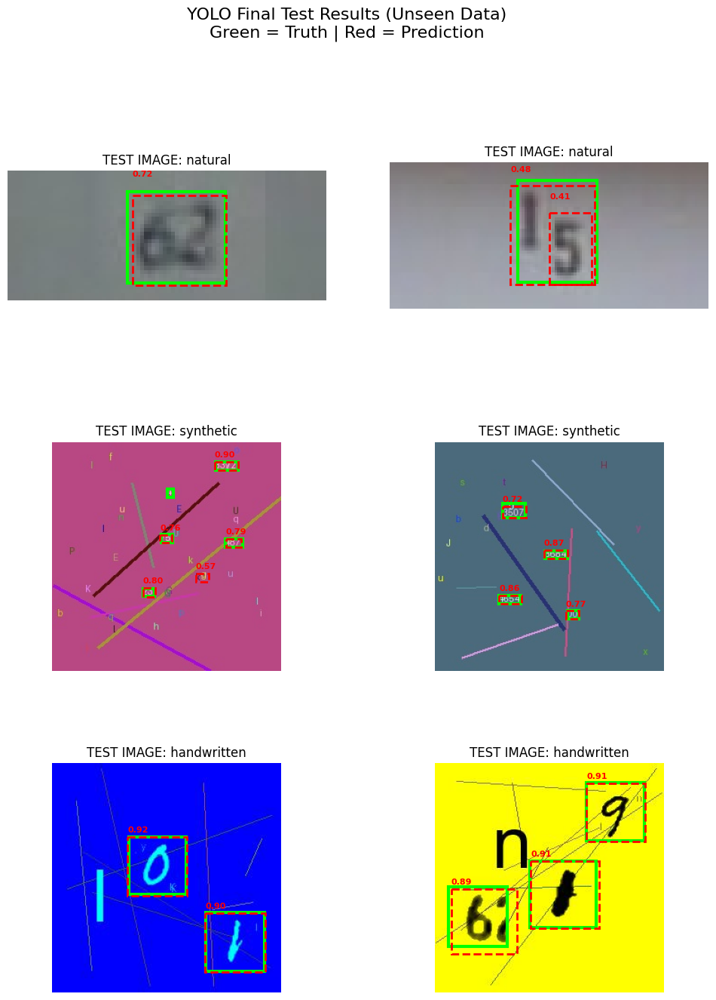
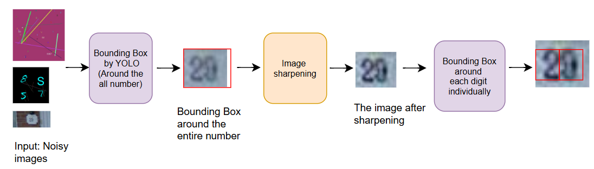
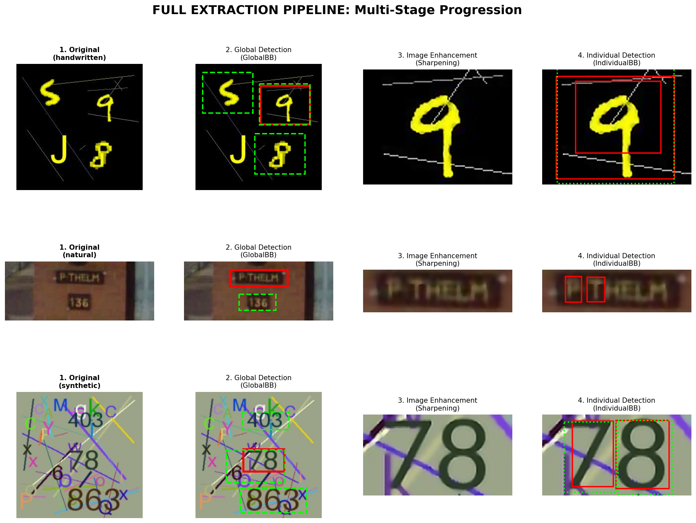
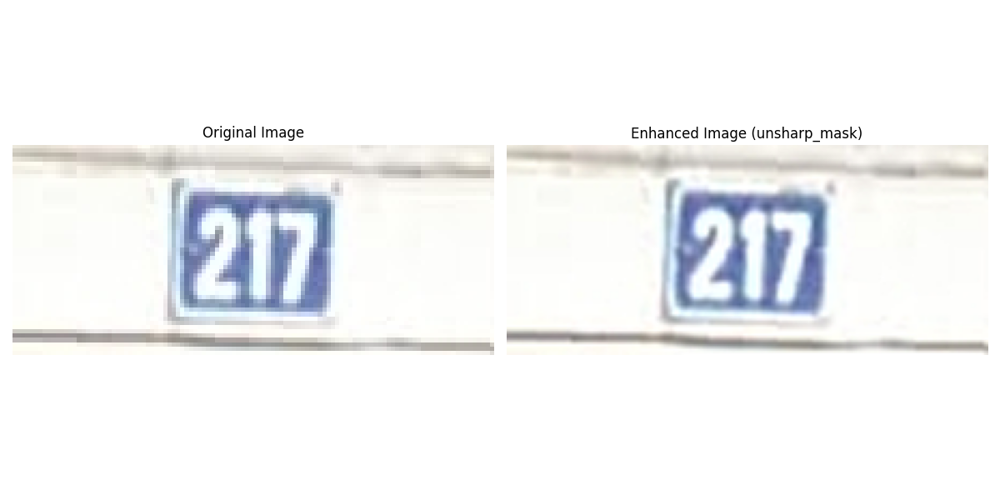

# Project Evolution & Development Milestones

This section documents the iterative improvements made to the **ExtractNumbers** pipeline, focusing on the transition from simple global detection to a sophisticated, AI-powered multi-stage OCR system.

---

## 🟢 Stage 1: Foundation & Global Bounding-Box Detection
**Focus:** Establishing the automated data pipeline and baseline detection metrics.

*   **BB Strategy:** **Global Bounding Box (GlobalBB).** The model focused on identifying the **entire number** sequence as a single entity within noisy source images.
*   **Initial Setup:** Automated data fetching and processing pipeline (MNIST, SVHN, and Synthetic data).
*   **Key Model:** YOLOv8n (Initial training for 20 epochs).

### 📈 Results
| Metric | Value |
| :--- | :--- |
| **Overall mAP50** | **92.15%** |
| Precision | 89.58% |
| Recall | 81.04% |

| Category | Accuracy (Avg. Confidence) |
| :--- | :--- |
| Handwritten | 88.79% |
| **Natural (SVHN)** | **48.08%** (Baseline) |
| Synthetic | 64.08% |

**Example Result:**

> **Conclusion:** While the pipeline was functional, the model struggled significantly with "Natural" images and lacked the precision to isolate overlapping digits.
---
## 🟢 Stage 2: Hierarchical 3-Step Process & Basic Sharpening 
**Focus:** Realizing that global detection isn't enough, we introduced a hierarchical flow to isolate individual digits.

**Architecture Diagram (The 3-Step Flow):**

### 🔄 The 3-Step Workflow:
1.  **Global Detection:** Identify the Bounding Box (BB) for the **entire number sequence**.
2.  **Preprocessing:** Crop the global BB and apply **Basic Sharpening** (Unsharp Masking) and upscaling to separate tight digits (NEW).
3.  **Individual Localization:** Perform a second detection (IndividualBB) to find the **BB of each specific digit** within the sharpened crop (NEW).

*   **Augmentations:** Added White Noise, Blur, and Stretching/Pixelation to improve robustness against various image qualities.

### 📈 Results
#### 1. Global Bounding Box Detection
| Metric | Value |
| :--- | :--- |
| **Overall mAP50** | **94.47%** ⬆️ |
| Precision | 84.19% ⬇️|
| Recall | 92.34% ⬆️|

**Accuracy per Category (Average Confidence):**
| Category | Accuracy |
| :--- | :--- |
| **Handwritten** | 74.85% ⬇️|
| **Natural (SVHN)** | 59.16% ⬆️|
| **Synthetic** | 75.41% ⬆️|

#### 2. Individual Digit Detection (Stage 3 of Flow)
| Metric | Value |
| :--- | :--- |
| **Overall mAP50** | **92.86%** |
| Precision | 88.54% |
| Recall | 94.09% |

**Example Result:**

> **Conclusion:** While the split helped, we noticed that **basic sharpening was insufficient** for complex noise, and the dataset still lacked "character labels" for actual recognition.

---

## 🟢 Stage 3: AI Restoration & End-to-End OCR
**Focus:** Overhauling the data structure and integrating AI-powered restoration for production-grade accuracy.

**Final System Architecture:**

*   **Data Overhaul:** **Complete Data Deletion & Replacement.** The dataset was transitioned to a **Unified Metadata Schema** (`annotations.json`). This new structure links every image to its actual numeric value (Labels), enabling full OCR capabilities.
*   **Sharpening (Stage 2):** Upgraded from basic unsharp/sharpen filters to the project’s AI image enhancement pipeline in `src/image_preprocessing/`, improving low-quality crop clarity before digit detection.
*   **Final Classification (Stage 4):** Implemented a **ResNet18** classifier to convert isolated digit crops into final numeric strings.
*   **Succession Rate Metric:** Introduced a conditional probability metric to measure sequence consistency:
  $$P(D_{i+1} \text{ correct} | D_i \text{ correct})$$

### 📈 Results
#### 1. Individual Digit Localization

| Metric | Value |
| :--- | :--- |
| Mean IoU (all digits) | 0.8267 |
| Mean Confidence | 0.7983 |
| Overall Recall | 101.24% |
| Total GT Digits | 4514 |
| Total Pred Digits | 4570 |

**Performance by Category:**
| Category | Mean IoU | Recall |
| :--- | :--- | :--- |
| Handwritten | 0.8748 | 100.77% |
| SVHN | 0.8389 | 101.27% |

> **Note:** The integration of AI enhancement improved digit localization precision and overall individual box coverage, as reflected by the 0.8267 mean IoU and very high recall across both categories.

#### 2. Image Sharpening Comparison

**Pipeline Performance Comparison:**

| Metric | With Sharpening | Without Sharpening (Baseline) |
| :--- | :--- | :--- |
| Full Sequence Accuracy | 68.20% | 68.00% |
| Mean Digit Accuracy (Pos) | 81.61% | 80.62% |
| Stage 1 (Global) Mean IoU | 0.7516 | 0.7612 |
| Stage 3 (Individual) Mean IoU | 0.7573 | 0.7585 |

**Sharpening Enhancement Metrics:**

| Metric | Result |
| :--- | :--- |
| Total Processed | 2000 |
| Average Duration | 0.0006s |
| Throughput | 5,135,519 pixels/sec |
| Avg Upscale Factor | 2.00x |
#### 3. Digit Classification

| Metric | Value |
| :--- | :--- |
| Overall Accuracy | 93.75% |
| Handwritten Accuracy | 98.85% |
| SVHN Accuracy | 93.44% |

Detailed per-digit classification scores are available in the evaluation report, with overall support of 4514 digits across both categories.

#### 4. Full End-to-End Pipeline Performance

| Metric | Overall | Handwritten | SVHN |
| :--- | :--- | :--- | :--- |
| Full Sequence Accuracy | 70.25% | 58.50% | 82.00% |
| Mean Digit Accuracy (Pos) | 81.89% | 74.33% | 89.46% |
| Stage 1 (Global) Mean IoU | 0.7635 | 0.7226 | 0.8044 |
| Stage 3 (Individual) Mean IoU | 0.7629 | 0.7810 | 0.7461 |

###
> **Conclusion:** The pipeline now produces a working end-to-end OCR workflow, with full-sequence success at 70.25% and strong digit-level accuracy across both handwritten and SVHN samples. Performance improved with the AI-powered sharpening enhancement in Stage 2.

> **Note:** The reported Stage 3 recall can exceed 100% because it is currently calculated as the ratio of total predicted digit boxes to total ground-truth digit boxes, not as the standard TP/(TP+FN) recall. This means extra predicted boxes can push the metric above 100%.

**Full Pipeline Progression:**

The generated dashboard and detailed error analysis are captured in the evaluation reports under `outputs/reports`.

example for image sharpening (not cherry picked. if you want you can alter the visualize_enhancement.py to run in a loop and cherry pick the best result)

---

## 🟢 Stage 4: Data Library Corrections & Video Infrastructure

**Focus:** Improving evaluation reliability, benchmarking all enhancement methods, and laying the groundwork for video-based inference.

*   **Sharpening Benchmark:** Evaluated all 10 enhancement methods to determine the best preprocessing step for the pipeline.
*   **Recall Bug Fix:** Corrected the over-100% recall issue — recall was previously calculated as `predicted boxes / GT boxes` instead of the standard `TP / (TP + FN)`.
*   **Evaluation:** *(in progress)*
*   **Captured Data:** New evaluation images captured externally will be added to the dataset. *(in progress)*
*   **Video Pipeline — Data:** Collecting video data for inference. *(in progress)*
*   **Video Pipeline — Frame Exploration:** Investigating optimal frame sampling strategies. *(in progress)*
*   **Video Pipeline — Sharpening Frames:** Exploring the effect of enhancement across multiple frames. *(in progress)*

---

### 📈 Results
הכל פה צריך לעדכן- מתי סליחה מראש🦥

#### 1. Global Bounding Box Detection

| Metric | Overall | Handwritten | SVHN | Synthetic |
| :--- | :--- | :--- | :--- | :--- |
| mAP50 | — | — | — | — |
| Precision | — | — | — | — |
| Recall | — | — | — | — |

---

#### 2. Image Sharpening Benchmark — All 10 Methods

To find the best enhancement for our pipeline, we evaluated all 10 available sharpening/super-resolution methods using `src/evaluation/run_all_enhancements.py`.

**The 10 methods evaluated:**

| # | Method | Description |
| :--- | :--- | :--- |
| 1 | `none` | Baseline — no enhancement |
| 2 | `unsharp_mask` | Classic Gaussian-blur-based unsharp masking |
| 3 | `clahe` | Contrast Limited Adaptive Histogram Equalization |
| 4 | `esrgan` | Real-ESRGAN deep-learning super-resolution |
| 5 | `edsr` | EDSR — Enhanced Deep Residual Networks |
| 6 | `lapsrn` | LapSRN — Laplacian Pyramid SR Network |
| 7 | `realcugan` | Real-CUGAN — lightweight GAN super-resolution |
| 8 | `bsrgan` | BSRGAN — Blind Super-Resolution GAN |
| 9 | `swiniR` | SwinIR — Swin Transformer Image Restoration |
| 10 | `diffusion` | Diffusion Upscaler — Stable Diffusion 4× |

**Statistics Per Method:**

| Method | Full Seq Accuracy | Mean Digit Accuracy | Stage 1 IoU | Stage 3 IoU | Succ Rate |
| :--- | :--- | :--- | :--- | :--- | :--- |
| **`none` (Best)** | **68.00%** | **80.62%** | **0.7612** | **0.7585** | **92.87%** |
| `unsharp_mask` | 66.40% | 79.78% | 0.7612 | 0.7537 | 92.18% |
| `clahe` | 58.20% | 74.33% | 0.7612 | 0.7401 | 91.53% |
| `esrgan` | 61.00% | 75.57% | 0.7612 | 0.7542 | 90.69% |
| `edsr` | 67.50% | 80.58% | 0.7612 | 0.7563 | 92.51% |
| `lapsrn` | 67.50% | 80.58% | 0.7612 | 0.7563 | 92.51% |
| `realcugan` | 67.50% | 80.58% | 0.7612 | 0.7563 | 92.51% |
| `bsrgan` | 67.50% | 80.58% | 0.7612 | 0.7563 | 92.51% |
| `swiniR` | 54.20% | 71.07% | 0.7612 | 0.7189 | 89.27% |
| `diffusion` | 67.00% | 79.86% | 0.7612 | 0.7545 | 92.58% |

> **Selected Method:** Based on the benchmark results above, we chose the method: **`none` (Baseline without enhancement)**
> Interestingly, the AI upscalers (EDSR, LapSRN, etc.) performed extremely similarly to each other but slightly worse than the original raw crop, indicating that the noise added by super-resolution artifacts slightly outweighed the sharpening benefits for the YOLO individual-digit detector.

**Selected Method Performance — By Data Category:**

| Category | Full Seq Accuracy | Mean Digit Accuracy | Stage 1 IoU | Stage 3 IoU | Succ Rate |
| :--- | :--- | :--- | :--- | :--- | :--- |
| Handwritten | 56.40% | 73.59% | 0.7183 | 0.7759 | 91.92% |
| SVHN | 79.60% | 87.65% | 0.8040 | 0.7423 | 93.76% |
| Synthetic | N/A | N/A | N/A | N/A | N/A |

---

#### 3. Digit Classification

| Metric | Overall | Handwritten | SVHN | Synthetic |
| :--- | :--- | :--- | :--- | :--- |
| Accuracy | 86.60% (F1-macro 82.00%) | 77.00% | 87.00% | N/A |

*(Note: Classification accuracy is derived from the precision/recall F1 scores of the End-to-End benchmark's classification stage.)*

---

#### 4. Full End-to-End Pipeline Performance

| Metric | Overall | Handwritten | SVHN | Synthetic |
| :--- | :--- | :--- | :--- | :--- |
| Full Sequence Accuracy | 68.00% | 56.40% | 79.60% | N/A |
| Mean Digit Accuracy (Pos) | 80.62% | 73.59% | 87.65% | N/A |
| Succession Rate | 92.87% | 91.92% | 93.76% | N/A |
| Stage 1 (Global) Mean IoU | 0.7612 | 0.7183 | 0.8040 | N/A |
| Stage 3 (Individual) Mean IoU | 0.7585 | 0.7759 | 0.7423 | N/A |

> **Conclusion:** *(to be written after benchmark results are in)*

**Full Pipeline Visualization:**

The generated dashboard and detailed error analysis are captured in the evaluation reports under `outputs/reports`.

---

