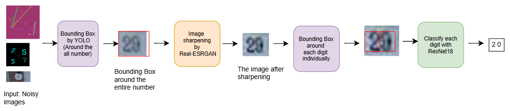
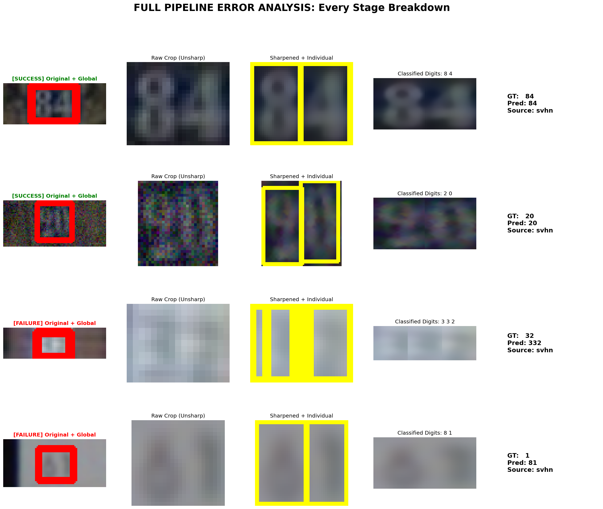

# ExtractNumbers

A comprehensive image recognition and segmentation dataset generation pipeline for digit extraction from noisy environments.

## Initial Setup

1. **Install Dependencies**:
   Ensure you have Python 3.12+ installed. Create a virtual environment and install the requirements:

   ```bash
   python3 -m venv .venv
   source .venv/bin/activate
   pip install -r requirements.txt
   ```

2. **Run Data Preparation**:
   The entire data fetching and processing pipeline is automated. Just run the following command from the project root:

   ```bash
   python src/prep_data.py
   ```

---

## 📂 Project Structure
The source code is organized into specialized modules:

* **[`src/training/`](src/training/README.md)**: Full pipeline training orchestrators.
* **[`src/inference/`](src/inference/README.md)**: Production prediction scripts.
* **[`src/data/`](src/data/README.md)**: Dataset loading and normalization.
* **[`src/bounding_box/`](src/bounding_box/README.md)**: Stage 1 & 3 YOLO detection.
* **[`src/image_preprocessing/`](src/image_preprocessing/README.md)**: Stage 2 Real-ESRGAN enhancement.
* **[`src/digit_recognizer/`](src/digit_recognizer/README.md)**: Stage 4 ResNet18 classification.
* **[`src/evaluation/`](src/evaluation/README.md)**: Multi-stage benchmarking suite.
* **[`src/utils/`](src/utils/README.md)**: Shared helper functions.

For a comprehensive technical reference of all scripts, see the **[Source API Documentation](src/API.md)**.

---

## Pipeline Workflow

The extraction process is divided into four main stages:

1.  **Global Bounding-Box Detection (GlobalBB):** Localizes the entire number sequence within the noisy source image.
2.  **Super-Resolution & Sharpening:** Implements **Real-ESRGAN** to enhance visual quality, recovery of fine details, and edge sharpening.

מתי סליחה מראש🦥
מתי סליחה מראש- אולי צריך לעדכן את שם החידוד 
3.  **Individual Digit Localization (IndividualBB):** Detects and segments each digit individually within the sharpened crops.
4.  **Neural Character Recognition (Classification):** ResNet18-based classification of localized digits into final values (0-9).



---

### Core Pipeline Execution

The system is designed for high-performance batch processing and seamless model synchronization.

**To train and run the full batch pipeline:**
```bash
python src/training/train_pipeline.py
```

**To run prediction on a single image:**
```bash
python src/inference/predict_single.py path/to/image.png
```

#### Control Flags
- `--skip-train`: Automatically skips training if valid weights already exist.
- `--force-train`: Forces a fresh training cycle for both YOLO stages.
- `--analyze-only`: Skips heavy detection/training and generates reports from previous results.
- `--viz-only`: Regenerates the progression visualizations from existing predictions.

---

## Evaluation & Insights

The pipeline is evaluated across four isolated stages and one comprehensive end-to-end benchmark.

### 🔍 Metric Definitions
To ensure clarity across all reports, the following metrics are used:
*   **Mean IoU (Intersection over Union)**: Measures the spatial overlap between the predicted bounding box and the ground truth. A score of 1.0 is a perfect match.
*   **Detection Rate**: The percentage of samples where the model successfully proposed at least one bounding box.
*   **mAP@0.5**: "Mean Average Precision" at a 50% IoU threshold. This is the standard accuracy metric for object detection.
*   **Precision**: The percentage of positive predictions that were actually correct (Quality).
*   **Recall**: The percentage of actual ground truth objects that were successfully detected (Quantity).
*   **Full Sequence Accuracy**: The percentage of images where the **entire** predicted number string exactly matches the ground truth.
*   **Mean Digit Accuracy (Pos)**: The percentage of digits correctly identified at their specific index in the sequence.
*   **Succession Rate**: The probability that a digit is correct given that the *previous* digit was correct. This measures the model's ability to maintain consistency across a sequence.

### 📊 Stage 1: Global Bounding Box Detection
*Evaluates the ability to localize the entire number sequence.*

| Category | Mean IoU | Detection Rate | mAP@0.5 |
| :--- | :--- | :--- | :--- |
| **Overall** | 0.7956 | 99.20% | 94.95% |
| **Handwritten** | 0.7205 | 94.37% | 84.51% |
| **SVHN** | 0.7992 | 99.43% | 95.43% |

### 📊 Stage 2: Image Sharpening Enhancement
*AI-powered enhancement performance metrics.*
מתי סליחה מראש🦥- לעדכן טאחרי הריצה החדשה
| Metric | Result |
| :--- | :--- |
| **Total Processed** | 2000 samples |
| **Average Duration** | 0.0006s |
| **Throughput** | 5,135,519 pixels/sec |
| **Avg Upscale Factor** | 2.00x |


| Category | Full Seq Accuracy | Mean Digit Accuracy | Stage 1 IoU | Stage 3 IoU |
| :--- | :--- | :--- | :--- | :--- |
| Handwritten | — | — | — | — |
| SVHN | — | — | — | — |
| Synthetic | — | — | — | — |


### 📊 Stage 3: Individual Digit Localization
*Evaluates digit segmentation within sharpened crops.*


מתי סליחה מראש🦥- לעדכן טאחרי הריצה החדשה


| Category | Mean IoU | Recall |
| :--- | :--- | :--- |
| **Overall** | 0.8267 | 101.24% |
| **Handwritten** | 0.8748 | 100.77% |
| **SVHN** | 0.8389 | 101.27% |

### 📊 Stage 4: Digit Classification
*Isolated classification performance (ResNet18).*


מתי סליחה מראש🦥- לעדכן טאחרי הריצה החדשה


| Category | Accuracy | Support |
| :--- | :--- | :--- |
| **Overall** | 93.75% | 4514 digits |
| **Handwritten** | 98.85% | - |
| **SVHN** | 93.44% | - |

### 🏆 Full End-to-End Pipeline Performance
*Master benchmark: Raw pixels → Final predicted string.*


מתי סליחה מראש🦥- לעדכן טאחרי הריצה החדשה


| Metric | Overall | Handwritten | SVHN |
| :--- | :--- | :--- | :--- |
| **Full Sequence Accuracy** | **70.25%** | **58.50%** | **82.00%** |
| **Mean Digit Accuracy (Pos)**| **81.89%** | **74.33%** | **89.46%** |
| **Stage 1 Mean IoU** | 0.7635 | 0.7226 | 0.8044 |
| **Stage 3 Mean IoU** | 0.7629 | 0.7810 | 0.7461 |

---


### How to Run Evaluations
The suite is divided into scripts for isolated performance analysis. You can now specify custom data sources for evaluation:

```bash
# Run ALL evaluations (Stages 1-4 + Full End-to-End Pipeline)
python src/evaluation/eval_all.py --max-samples 100

# Full End-to-End pipeline benchmark with error analysis dashboard
python src/evaluation/eval_pipeline.py --max-samples 500 --save-viz --analyze-errors

# Evaluate on custom datasets (e.g., the Trains OCR dataset)
python src/evaluation/eval_pipeline.py --data-root data/ocr_trains --output-dir outputs/trains_eval
```

## 📊 Dataset Integration
The pipeline now supports "Weakly Labeled" datasets—data that contains global number/plate bounding boxes and sequence labels but lacks fine-grained individual digit annotations.

| Dataset | Type | Samples | Command to Prepare |
| :--- | :--- | :---: | :--- |
| **Trains OCR** | Weakly Labeled | 13 | `python src/data/ocr_trains.py` |
| **Race Numbers** | Fully Labeled | 10,000+ | `python src/prep_data.py --datasets race_numbers` |
| **Handwritten** | Fully Labeled | 10,000+ | `python src/prep_data.py --datasets handwritten` |
| **SVHN / Digits** | Fully Labeled | 200,000+ | `python src/prep_data.py --datasets svhn` |

### Handling Weakly Labeled Data
When a dataset is identified as weakly labeled (`has_digit_boxes=False` in `annotations.json`):
1.  **Stage 1 (Global Detection)**: Evaluated as normal using Mean IoU.
2.  **Stage 3 (Individual Detection)**: Skipped for metric calculation to avoid statistical contamination.
3.  **End-to-End Accuracy**: Calculated by comparing the final OCR output with the ground truth sequence label.

### Pipeline Progression

מתי סליחה מראש🦥- לעדכן טאחרי הריצה החדשה


### Error Analysis
Detailed breakdown of how the model succeeds or fails at each individual step:



---

## 🎬 Video Asset Generation

Runs the full 4-stage pipeline on **9 representative images** — 3 randomly selected from each data type (SVHN, Race Numbers, Handwritten) — and saves the per-stage visual output for use in a demo video.

```bash
python src/generate_video_assets.py \
    --model-dir outputs/trained_models \
    --data-root data/digits_data \
    --out-dir   video_assets
```

This produces the folder `video_assets/` with one sub-folder per pipeline stage:

| Folder | Contents |
| :--- | :--- |
| `01_samples/` | 9 raw input images (3 per data type) |
| `02_global_bb/` | Each image with the GlobalBB rectangle drawn |
| `03_sharpened/` | Real-ESRGAN enhanced crop |
| `04_individual_bb/` | Sharpened crop with per-digit boxes |
| `05_classification/` | Digit labels overlaid + predicted number banner |

> **Note:** Statistics and accuracy metrics are not computed by this script.
> Use the evaluation suite (`src/evaluation/`) for benchmarking.

---