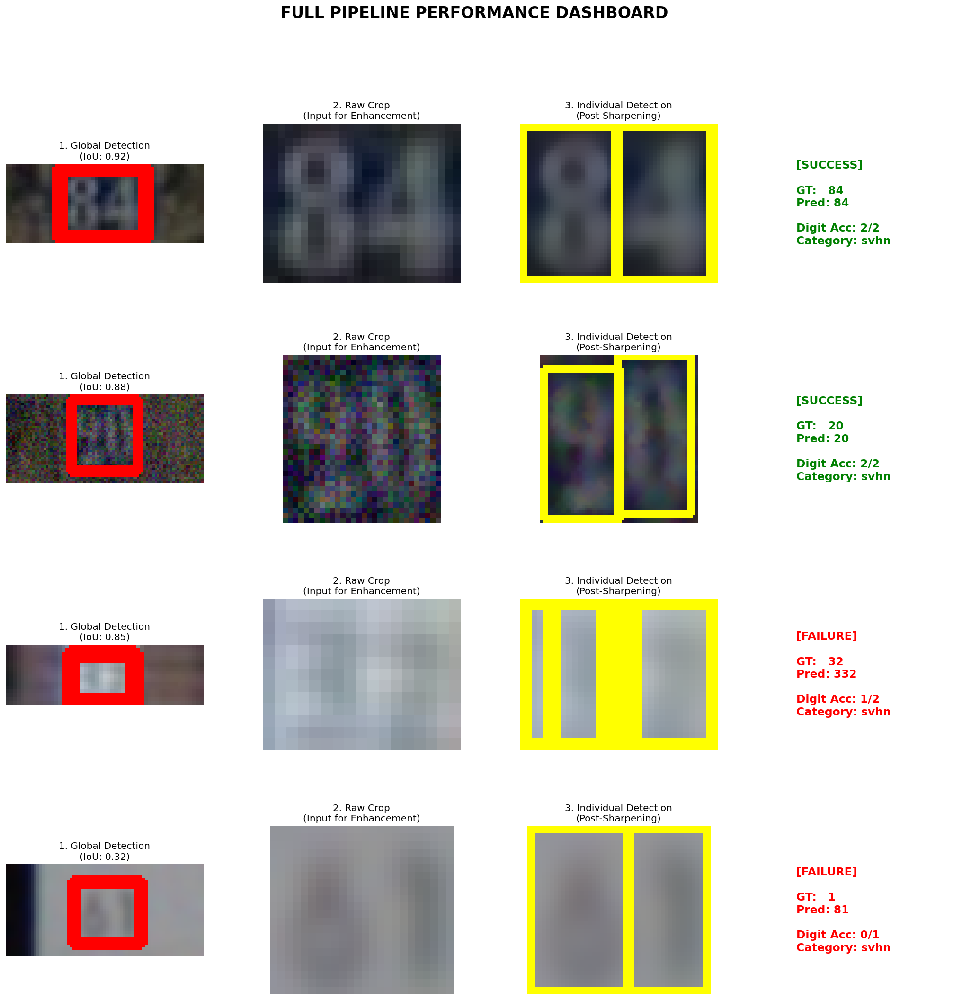

# ExtractNumbers

A comprehensive image recognition and segmentation dataset generation pipeline.

## Initial Setup

1. **Install Dependencies**:
   Ensure you have Python 3.12+ installed. Create a virtual environment and install the requirements:

   ```bash
   python3 -m venv .venv
   source .venv/bin/activate
   pip install -r requirements.txt
   ```

2. **Run Data Preparation**:
   The entire data fetching and processing pipeline is automated. Just run the following command from the project root:

   ```bash
   python src/prep_data.py
   ```

## Dataset Structure

After running the preparation script, your `data/` directory will be structured as follows:

* **Classification** (`data/classification/`)
  * `single_digits/`: 5,000+ images per digit (0-9) from MNIST, SVHN, and Handwritten sources.
  * `multi_digits/`: 2,000 synthesized multi-digit sequences with surrounding letter noise.
* **Segmentation** (`data/segmentation/`)
  * `natural/`: 500 house number images (SVHN Format 1) with paired binary masks.
  * `synthetic/`: 500 high-noise synthetic images with paired binary masks.
  * `handwritten/`: 500 high-contrast handwritten digit samples with randomized color palettes and large distractor letters.
  * #### Data Augmentation & Noise Summary
      The segmentation dataset underwent various augmentation processes to improve model robustness, including White Noise, Blur, and Stretching/Pixelation:
      
      | Dataset Type | White Noise | Blur | Stretching / Pixelation |
      | :--- | :--- | :--- | :--- |
      | **Synthetic** | ✅ Applied globally to the entire image. | ✅ Applied globally to the entire image. | ✅ Applied globally to the entire image. |
      | **Handwritten** | ⚠️ Only on digits (from classification stage). | ⚠️ Only on digits (from classification stage). | ⚠️ Only on digits (from classification stage). |
      | **Natural (SVHN)** | ❌ Not applied; uses original quality. | ❌ Not applied; uses original quality. | ❌ Not applied; uses original quality. |


Each segmentation sample is isolated in its own numeric folder (e.g., `data/segmentation/synthetic/0/image.jpg` and `data/segmentation/synthetic/0/mask.png`).


***** יואב, להוסיף כאן הסבר על הדאטה ***_

## Pipeline Workflow

The extraction process is divided into four main stages, designed to handle noisy inputs and ensure high-accuracy digit recognition:

1.  **Global Bounding-Box Detection (GlobalBB):** Utilizing a YOLO-based architecture to localize the entire number sequence within the noisy source image, filtering out irrelevant background elements.
2.  **Super-Resolution & Sharpening:** Implementing Real-ESRGAN to enhance the visual quality of the cropped area. This stage recovers fine details and sharpens edges, which is critical for processing low-resolution or blurred inputs.
3.  **Individual Digit Localization (IndividualBB):** Once the image is sharpened, the pipeline detects and segments each digit individually to prepare them for precise classification.
4.  **Neural Character Recognition (Classification):** Each localized digit is passed through a ResNet18 classifier to identify its value. The final output is a reconstructed string representing the full number.

---
The project follows a multi-stage pipeline to ensure high accuracy in digit extraction and recognition:


### Stage 1: Global Bounding-Box Detection (GlobalBB)

**How it works:** This stage identifies the entire number sequence as a single entity. The script scans the ground-truth masks, extracts bounding box coordinates for each valid digit blob, and builds a YOLO-compatible dataset. It performs an 80/20 train-validation split and trains a YOLOv8n model for 20 epochs.

**To run the GlobalBB pipeline:**
```bash
python "src/bounding_box/run_globalbb_flow.py"
```

> [!TIP]
> If you have already trained the GlobalBB model, you can skip the training phase and run inference only by appending the `--skip-train` flag:
> ```bash
> python "src/bounding_box/run_globalbb_flow.py" --skip-train
> ```

#### **Current Evaluation Results (Stage 1)**
The GlobalBB detection model achieves high accuracy across various noise levels:
* **Overall mAP50**: 94.47%
* **Precision**: 84.19%
* **Recall**: 92.34%

**Accuracy per Category (Average Confidence):**
* **Handwritten**: 74.85%
* **Natural**: 59.16%
* **Synthetic**: 75.41%

---
## Stage 2: Image Sharpening (Real-ESRGAN)

This stage focuses on improving the signal-to-noise ratio of the detected number sequence. By applying Generative Adversarial Networks (GANs) for super-resolution, we ensure that the subsequent classification model receives clear, high-contrast inputs.

***** מתי, נא להוסיף כאן הסבר ודוגמאות של תמונות לפני ואחרי החידוד ***_

---
### Stage 3: Individual Digit Detection (IndividualBB)

**How it works:** This stage focuses on isolation and precision. We utilize a second YOLOv8 model trained specifically on **sharpened crops** of the number sequences detected in Stage 1. By upscaling and applying unsharp masking, the model can more accurately distinguish between tightly packed or overlapping digits.

**To generate the sharpened dataset:**
```bash
python "src/bounding_box/individualbb_detector.py" --prepare-only
```

**To run IndividualBB training:**
```bash
python "src/bounding_box/individualbb_detector.py" --train-only --epochs 20
```

#### **Evaluation Results (Stage 2)**
The IndividualBB model is trained to detect a single class ("digit") across all sharpened crops. The current model achieves high precision in isolating individual digits:
* **Overall mAP50**: 99.27%
* **Precision**: 98.45%
* **Recall**: 98.22%

---

## Stage 4: Digit Classification (ResNet18)

In this final phase, we utilize the ResNet18 architecture, known for its effectiveness in image recognition tasks through residual learning. The model classifies each individual cropped digit into one of the ten categories (0-9).

***** מתי/יואב, נא להוסיף כאן הסבר ודוגמאות על מודל הסיווג (ניתן להעביר לכאן הסברים רלוונטיים מסוף המסמך) ***_

---
### Full Automated Extraction Process

For a seamless experience, the entire multi-stage flow (Detection → Sharpening → Individual Localization) can be executed via a single command. The script handles model synchronization and dataset handoffs automatically.

**To run the full pipeline:**
```bash
python src/full_pipelines/batch_pipeline.py
```

**To run on a single image:**
```bash
python src/full_pipelines/predict_single.py path/to/image.png
```

#### **Control Flags**
The pipeline script offers granular control over the process:
* **`--skip-train`**: (Default behavior) Automatically skips training for any stage where valid model weights already exist.
* **`--force-train`**: Clears previous runs and forces a fresh training cycle for both GlobalBB and IndividualBB.
* **`--analyze-only`**: Skips the heavy detection and training phases entirely, generating reports from previous results.
* **`--viz-only`**: Quickly regenerates the 4-panel progression visualization using existing predictions.
---
## Project Results

***** יואב, נא להוסיף כאן את תוצאות התהליך ***_

***** נא להוסיף תמונה מסודרת המציגה את כל שלבי התהליך עבור 3 סוגי הדאטה (Pipeline Visualization): ***_
`Input Image -> Global BB -> Sharpened Image -> Individual BB -> Final Classification Output`


----------------------------------------------------------------------
מה שכאן צריך למחוק או לשים בחלק הרלוונטי בתהליך.
אז מתי כשאתה עורך אם השתמשת תעיף ואם לא צריך גם תעיף רק תעיף
## Evaluation & Insights

A dedicated evaluation suite (`src/evaluation/`) tests the extraction and classification accuracy of different image enhancement methods.

We compared four preprocessing strategies before feeding the digits to the ResNet18 classifier:
1. **Real-ESRGAN**: AI-powered super-resolution.
2. **Traditional**: Classic cubic upscaling, bilateral filtering, and unsharp masking.
3. **No-Sharpen**: Basic grayscale conversion and binarization.
4. **Both**: Real-ESRGAN followed by traditional unsharp masking.

### 1. Isolated Digit Classification Accuracy
Tested on 76,803 extracted digits from the full dataset using the ResNet18 classifier:

| Digit | Precision | Recall | F1-Score | Support |
| :--- | :--- | :--- | :--- | :--- |
| **0** | 0.97 | 0.97 | 0.97 | 5,297 |
| **1** | 0.97 | 0.98 | 0.98 | 14,235 |
| **2** | 0.98 | 0.97 | 0.98 | 10,957 |
| **3** | 0.98 | 0.96 | 0.97 | 8,867 |
| **4** | 0.97 | 0.99 | 0.98 | 7,786 |
| **5** | 0.95 | 0.98 | 0.97 | 7,237 |
| **6** | 0.99 | 0.94 | 0.96 | 6,073 |
| **7** | 0.98 | 0.97 | 0.98 | 5,980 |
| **8** | 0.96 | 0.96 | 0.96 | 5,383 |
| **9** | 0.97 | 0.98 | 0.97 | 4,988 |
| **AVG** | **0.97** | **0.97** | **0.97** | **76,803** |

*Method Performance Comparison (Top Accuracy):*
* **Real-ESRGAN**: **98.2%** 🏆
* **Traditional**: 91.0%
* **No-Sharpen**: 89.6%

### 2. End-to-End Pipeline Performance
Tested on the complete end-to-end flow using 500 random samples from the full dataset.

| Metric | Overall | Natural (SVHN) | Handwritten |
| :--- | :--- | :--- | :--- |
| **Full Sequence Accuracy** | **79.20%** | **80.33%** | 47.06% |
| **Mean Digit Accuracy** | **88.86%** | **89.25%** | **76.44%** |
| **Stage 1 (Global) IoU**| 0.7943 | - | - |
| **Stage 2 (Indiv) IoU** | 0.7390 | - | - |

#### Pipeline Evaluation Dashboard
Below is a visual breakdown of successes and failures across the 4-stage pipeline, including IoU metrics and positional digit accuracy:



**Key Takeaways:**
* **Sequence vs. Digit Accuracy**: While getting the *entire* number sequence correct is challenging (especially in Handwritten samples), the **Mean Digit Accuracy** remains high (~89%), meaning the pipeline correctly identifies almost 9 out of 10 characters in context.
* **Handwritten Performance**: Handwritten samples show significantly lower sequence accuracy due to the high variability of characters, but the individual digit recognition remains robust at 76%.
* **Real-ESRGAN Impact**: AI-powered sharpening remains the cornerstone for achieving the 80%+ accuracy seen in natural SVHN scenes.

### 3. How to Run Evaluations
Use the consolidated evaluation suite to reproduce these metrics:
```bash
# Evaluate the 0-9 classifier
python src/evaluation/evaluate_classifier.py

# Benchmark the full End-to-End pipeline
python src/evaluation/evaluate_pipeline.py --max-samples 500 --save-viz
```
