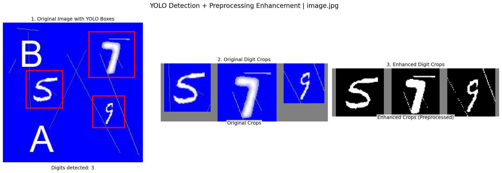

# ExtractNumbers

A comprehensive image recognition and segmentation dataset generation pipeline.

## Initial Setup

1. **Install Dependencies**:
   Ensure you have Python 3.12+ installed. Create a virtual environment and install the requirements:

   ```bash
   python3 -m venv .venv
   source .venv/bin/activate
   pip install -r requirements.txt
   ```

2. **Run Data Preparation**:
   The entire data fetching and processing pipeline is automated. Just run the following command from the project root:

   ```bash
   python src/prep_data.py
   ```

## Dataset Structure

After running the preparation script, your `data/` directory will be structured as follows:

* **Classification** (`data/classification/`)
  * `single_digits/`: 5,000+ images per digit (0-9) from MNIST, SVHN, and Handwritten sources.
  * `multi_digits/`: 2,000 synthesized multi-digit sequences with surrounding letter noise.
* **Segmentation** (`data/segmentation/`)
  * `natural/`: 500 house number images (SVHN Format 1) with paired binary masks.
  * `synthetic/`: 500 high-noise synthetic images with paired binary masks.
  * `handwritten/`: 500 high-contrast handwritten digit samples with randomized color palettes and large distractor letters.
  * #### Data Augmentation & Noise Summary
      The segmentation dataset underwent various augmentation processes to improve model robustness, including White Noise, Blur, and Stretching/Pixelation:
      
      | Dataset Type | White Noise | Blur | Stretching / Pixelation |
      | :--- | :--- | :--- | :--- |
      | **Synthetic** | ✅ Applied globally to the entire image. | ✅ Applied globally to the entire image. | ✅ Applied globally to the entire image. |
      | **Handwritten** | ⚠️ Only on digits (from classification stage). | ⚠️ Only on digits (from classification stage). | ⚠️ Only on digits (from classification stage). |
      | **Natural (SVHN)** | ❌ Not applied; uses original quality. | ❌ Not applied; uses original quality. | ❌ Not applied; uses original quality. |


Each segmentation sample is isolated in its own numeric folder (e.g., `data/segmentation/synthetic/0/image.jpg` and `data/segmentation/synthetic/0/mask.png`).


## Extraction Pipeline
The project follows a multi-stage pipeline to ensure high accuracy in digit extraction and recognition:

1. **Input**: Segmentation data from the three categories (Natural, Synthetic, Handwritten) with applied noise and augmentations.
2. **Global Detection**: Using **YOLO** to detect and crop a Bounding Box around the entire number sequence.
3. **Image Sharpening**: Applying sharpening filters to the cropped Bounding Box to enhance digit clarity and edges.
4. **Individual Digit Detection**: A second **YOLO** pass on the sharpened image to detect and crop Bounding Boxes for each digit individually.


## Global Bounding-Box Detection

To run the bounding-box detection and evaluation pipeline, execute the following command from the project root:

```bash
python "src/bounding_box/run_yolo_flow.py"
```

### Evaluation Results

The current detection model achieves the following overall performance metrics:

* **Overall mAP50**: 92.15%
* **Precision**: 89.58%
* **Recall**: 81.04%

**Accuracy per Category (Average Confidence):**
* **handwritten**: 88.79% (Total samples: 1330)
* **natural**: 48.08% (Total samples: 752)
* **synthetic**: 64.08% (Total samples: 1932)

## Global Detection & Image Sharpenin Examples

Below is a demonstration of the enhanced pipeline workflow, showing the complete digit detection and preprocessing enhancement process with three-panel visualizations:
